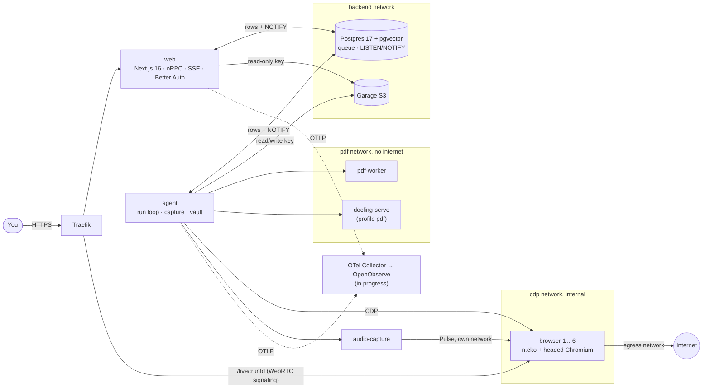

# MasterTutor

**A self-hosted AI study agent that drives its own browser and takes faithful notes.**


MasterTutor gives an AI agent a real, headed Chromium and a goal such as "take notes on this chapter".
It does browser use and computer use: it reads the page, looks at masked screenshots, clicks, types and scrolls.
It captures web pages, YouTube videos and PDFs 1:1. Captured text comes from the DOM, the PDF text layer or captions, never from a model rewrite.
When a site needs a login, the agent signs in through a sealed vault: it names a credential alias, and the model never sees the secret.
You can watch every run live and take over the browser at any moment by clicking into it.

The whole stack is one Docker Compose app on your own server. The OpenAI API is the only paid dependency.

---

## ✨ Highlights

- **Live view and takeover.** Each run streams its browser over WebRTC (with audio) through [n.eko](https://github.com/m1k1o/neko). Click into the stream to take control and press _Hand back_ to return it. The agent takes no screenshots while you hold control.
- **Approval modes per run.**
  - **Ask me:** risky actions (buy, pay, send, delete, submit, …), non-login form submits, downloads, new origins, first credential use and budget hits all pause for you.
  - **Auto in allowed domains:** the policy decides inside the run's allowlist.
  - **Bypass approvals:** an explicit, acknowledged opt-in with a persistent badge. Every decision is still audited.
  - Bypass never lifts the hard invariants. Secrets stay out of the model, logs and screenshots. Vault fills stay on the exact origin. The network policy and slot sandbox stay on. The kill switch and takeover always work. A prompt-injection check still pauses for a human.
- **The vault.**
  - Secrets are sealed with libsodium sealed boxes: `web` can only encrypt and `agent` alone can decrypt.
  - Each item is pinned to an origin. Fills check the frame origin and the field type.
  - Supported credentials: username, password, PIN (including split boxes), TOTP (codes generated server-side), OTP (from an in-app code box or an IMAP inbox) and passkeys (through a CDP virtual authenticator).
  - Signed-in sessions are sealed per alias and origin. All vault activity goes to an append-only audit table.
- **Faithful capture.**
  1. Snapshot the page as MHTML plus a full-page screenshot, both hashed.
  2. Extract with Defuddle (Readability as a fallback) in an isolated world.
  3. Store content-addressed images, SVG, canvas and diagrams.
  4. Verify against `innerText`: coverage of 98% or more marks a note `verified`, less marks it `partial`.

  Every block carries provenance: its origin, an anchor and a hash. Model commentary is visibly separate, and OCR'd content is marked `needs_review` until you verify it.

- **Video.** On YouTube the agent captures chapters and the player's own captions. Keyframes are sampled with a perceptual (DCT) distance. When there are no captions, an isolated `audio-capture` service records the tab audio for `gpt-4o-transcribe-diarize`. Media is never stored.
- **PDF.** A pdf.js text layer with page images runs in a sandboxed `pdf-worker`. The optional high-fidelity path uses docling-serve (Compose profile `pdf`). Both paths are verified against the pdf.js text.
- **Library.**
  - Notes live in nested folders, and the agent auto-files them (`gpt-6-luna`).
  - Hybrid search merges Postgres full-text and pgvector results with reciprocal-rank fusion.
  - Notes export as Obsidian-compatible Markdown with an `assets/` folder and YAML provenance.
  - The editor is Tiptap.
- **A persistent agent.** It sleeps when idle and wakes on activity. Each step is checkpointed in one transaction. Runs have budgets, loop detection, CAPTCHA handoff and a kill switch.
- **Observability** 🚧 _In progress._
  - **Built:** OpenTelemetry in `web` and `agent` through `packages/telemetry`. It has a typed `instrument()` wrapper at product seams, pino logs bridged to OTel, an attribute allowlist and bounded, non-blocking export.
  - **In progress:** an OTel Collector, OpenObserve on Garage, an owner-only `/observability` dashboard, and alerts delivered in the app and by Web Push.
- **Benchmark harness.** `tests/bench` runs graded suites against a production-like stack. It records evidence and a spend ledger, can re-grade from stored traces, and has a mock self-test (`pnpm bench:mock`).
- **Observer agent** 🚧 _In progress._ A metadata-only Guard that reviews risky steps, plus a read-only Copilot chat over runs and alerts. It is designed but not built yet.
- **Pip, the mascot** 🚧 _In progress._

  

## 🧭 How it works



- `web` and `agent` never call each other. They talk only through Postgres rows and `NOTIFY` messages that carry IDs. Run events reach the browser over one resumable SSE stream.
- Browser slots are not on the `backend` network, so a page can never reach Postgres, Garage or the app.
- Six slots by default. The agent claims a run and leases a slot in one transaction, and keeps one slot warm for wakes. Each slot restarts with an empty profile after every lease.

**The agent loop: observe → decide → approve → act.** Each phase is a row in `run_steps`, and each step commits in one transaction.

1. **Observe:** take a masked CDP screenshot and/or run `read_page`. If nothing changed, return `{unchanged: true}`.
2. **Decide:** call the OpenAI Responses API with seven typed tools: `computer`, `read_page`, `capture`, `fill_credential`, `use_passkey`, `video` and `annotate`.
3. **Approve:** the policy classifies the action. A risky action waits for you, depending on the run's approval mode.
4. **Act:** execute under the run's abort signal. A step interrupted by a crash is never replayed. The loop observes and decides again.

## 🔒 Security model

- **Secrets never reach the model, logs, traces or screenshots.**
  - The model sees aliases only, and `fill_credential` returns `{ok:true}` or an error code.
  - Model screenshots are CDP captures. Secret fields are masked after capture and re-checked against the accessibility tree.
  - `type` is refused into password, OTP and PIN fields.
- **Per-slot sandbox.**
  - Each browser runs in its own container with a custom seccomp profile and, in production, the `mastertutor-slot` AppArmor profile.
  - Startup iptables rules let only the agent reach CDP and audio.
  - Egress rules block loopback, RFC 1918, link-local and Docker ranges.
  - Navigation to an origin outside the allowlist needs approval.
- **Click guard.** While the executor sends input, a guard in every document cancels any pointer event that misses the element the hit test classified. This closes swap-the-button (TOCTOU) attacks, including in new frames and closed shadow roots. Typing fails closed if the guard cannot arm.
- **Page content is untrusted.** Page-derived strings are wrapped as untrusted content. Enforcement lives in code, never in the prompt.
- **OpenAI data policy.**
  - All OpenAI calls go through a single client factory that enforces `store: false`. No `previous_response_id`, metadata or user identifiers are sent.
  - Only stateless endpoints are used (Responses, embeddings, transcription).
  - The model context is rebuilt from our own transcript, so OpenAI holds no conversation state.
- **Least privilege.** Separate Postgres roles: `web` cannot read transcripts or decrypt the vault, and `agent` cannot touch the auth tables. Neither role can edit the audit log. Separate Garage keys give `web` read-only access and `agent` read/write access.
- **Owner-only observability** 🚧 _In progress._ The dashboard sits behind MasterTutor sign-in through Traefik ForwardAuth. Telemetry carries no secrets, page text or screenshots, enforced by an allowlist and tests.

## 🧱 Tech stack

| Layer     | Choice                                                                                                                |
| --------- | --------------------------------------------------------------------------------------------------------------------- |
| Web       | Next.js 16, React 19, Base UI + Tailwind v4, Tiptap 3, motion, oRPC, TanStack Query, Better Auth                      |
| Agent     | Node 24, Playwright over CDP, OpenAI `openai` SDK (Responses API + computer tool), libsodium, otplib, imapflow, sharp |
| Browser   | n.eko + headed Chromium + Xvfb + PulseAudio, per-slot seccomp/AppArmor                                                |
| Data      | PostgreSQL 17 + pgvector (Drizzle), Garage (S3)                                                                       |
| Documents | pdf.js, docling-serve, Defuddle / Readability                                                                         |
| Contracts | Zod 4 in `packages/contracts`, the single source of truth                                                             |
| Telemetry | OpenTelemetry, pino (OpenObserve in progress)                                                                         |
| Testing   | Vitest, Playwright, Testcontainers                                                                                    |
| Deploy    | Docker Compose on Dokploy, Traefik                                                                                    |

Models (OpenAI): `gpt-6-astra` (agent), `gpt-6.1-sol` (fallback), `gpt-6-luna` (filing and titles), `gpt-4o-transcribe-diarize` (ASR) and `text-embedding-3-small` (search).

## 🚀 Getting started

### Prerequisites

- Node ≥ 24.4, and pnpm 10.34.6 (through `corepack enable`).
- Docker with Compose v2.
- An **OpenAI API key**. It is the only paid dependency. Everything else is self-hosted and open source.

### 1. Install and generate secrets

```sh
pnpm install
pnpm env:init                       # writes the git-ignored .env with fresh secrets; prints key names only
pnpm env:init --out .env.bench      # the local-stack env file
```

`env:init` never prints or overwrites an existing value. Then set these by hand without sharing them anywhere:

- `OPENAI_API_KEY` in `.env`.
- In `.env.bench`, these lines, which the local stack requires:
  - `DOMAIN=localhost`
  - `TRAEFIK_ENTRYPOINT=web`
  - `TRAEFIK_TLS=false`
  - `PUBLIC_URL=http://localhost:18080`
  - `PUBLIC_IP=127.0.0.1`

### 2. Run the production-like stack locally

This uses the same images and Compose files as production, with a loopback Traefik in place of Dokploy:

```sh
docker compose -p mastertutor-bench --env-file .env --env-file .env.bench --profile pdf \
  -f compose.yml -f compose.prod.yml -f tests/bench/compose.local.yml \
  up -d --build --wait --wait-timeout 900
```

Open **http://localhost:18080**. The first account you sign up with owns the workspace. Further sign-ups are closed unless `AUTH_SIGNUP_OPEN=1`.

> Docker Desktop has no AppArmor, so locally the slots keep seccomp and Chromium's own sandbox only. Run one heavy stack at a time.

### UI-only fixture mode

Fixture mode serves the web app from a built-in fixture API, and never contacts the database, S3 or OpenAI. It is how the UI suite runs:

```sh
pnpm test:ui              # next build + start in fixture mode, then Playwright
PW_DEV=1 pnpm test:ui     # the same against next dev
```

Fixture mode is compiled out of production builds (`check:bundle` verifies it).

## 🧪 Testing

| Command                        | Suite                                                                                 |
| ------------------------------ | ------------------------------------------------------------------------------------- |
| `pnpm test`                    | Unit (Vitest)                                                                         |
| `pnpm test:int`                | Integration (Testcontainers)                                                          |
| `pnpm test:security`           | Security: secret canaries, policy and sandbox checks                                  |
| `pnpm test:behaviour`          | Behaviour against real browser slots                                                  |
| `pnpm test:ui`                 | Fixture-mode UI (Playwright, every breakpoint)                                        |
| `pnpm e2e`                     | Full-stack Playwright suite                                                           |
| `pnpm smoke`                   | Compose smoke test of the full stack (the remote `smoke` adds a backup/restore drill) |
| `pnpm bench:mock`              | Benchmark harness self-test                                                           |
| `pnpm lint` · `pnpm typecheck` | ESLint + Stylelint · `tsc`                                                            |

Heavy suites run on a remote Docker host, not a laptop. Each run is synced, isolated in its own Compose project and cleaned up afterwards:

```sh
scripts/remote-test.sh <suite>   # unit | integration | security | behaviour | ui | e2e | smoke | qa | bench-mock | web-build | agent-image
scripts/remote-test.sh all       # every suite but qa, concurrently, with one results table
```

See [`scripts/README.md`](scripts/README.md) for details.

## 🛳️ Deployment

MasterTutor deploys as **one Docker Compose app on [Dokploy](https://dokploy.com)** (`-f compose.yml -f compose.prod.yml`). Traefik serves the app and live-view signaling, and only the six WebRTC media ports are published.

The step-by-step guide covers the host setup, secrets, AppArmor, backups and the production smoke test. See [`infra/deploy-runbook.md`](infra/deploy-runbook.md). Before you deploy, check your env with `pnpm deploy:check-env <file>`.

**Live demo:** _coming soon_

## 🗂️ Project layout

```
apps/
  web/            Next.js app: UI, auth, oRPC API, SSE run events, vault sealing
  agent/          Run loop, slots, browser, tools, capture, video, PDF, audio, vault, guardrails
  browser-slot/   Slot image: n.eko + Chromium, policies, seccomp, entrypoint
packages/
  contracts/      Zod schemas: env, API, events, tools, blocks (single source of truth)
  db/             Drizzle schema, migrations, role grants
  sealing/        libsodium sealed-box helpers
  storage/        S3 client over Garage
  telemetry/      OpenTelemetry setup and instrument()
infra/            Deploy runbook, Garage, Traefik, host AppArmor and network scripts
scripts/          env-init, remote test runner, smoke, e2e, bench and QA scripts
tests/            bench, e2e, security, behaviour, smoke, fixtures, llm-mock
docs/             Design specs and implementation plans
compose.yml       Base stack · compose.prod.yml production overlay · compose.test.yml test overlay
```

## 🤝 Contributing

Read [`CLAUDE.md`](CLAUDE.md) first. Its engineering principles apply to every change:

- bloat-free;
- low latency;
- security first;
- modular, decoupled modules;
- one source of truth for each type, schema and rule.

Shared types belong in `packages/contracts`. Run `pnpm lint`, `pnpm typecheck` and the relevant suites before opening a PR.

## 📄 License

License: TBD.
